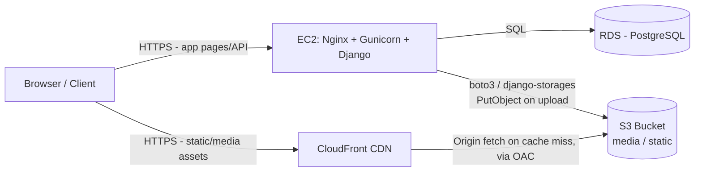
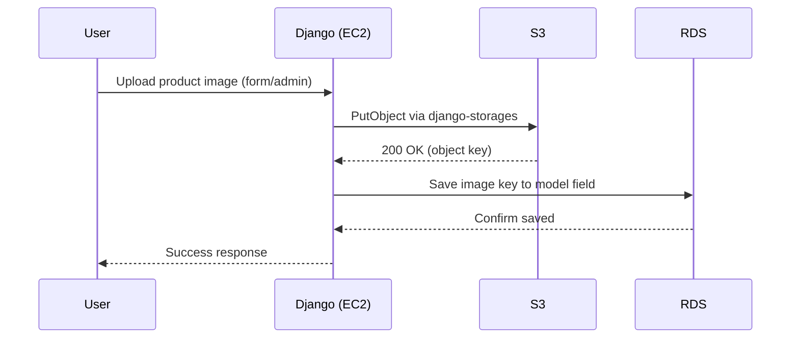
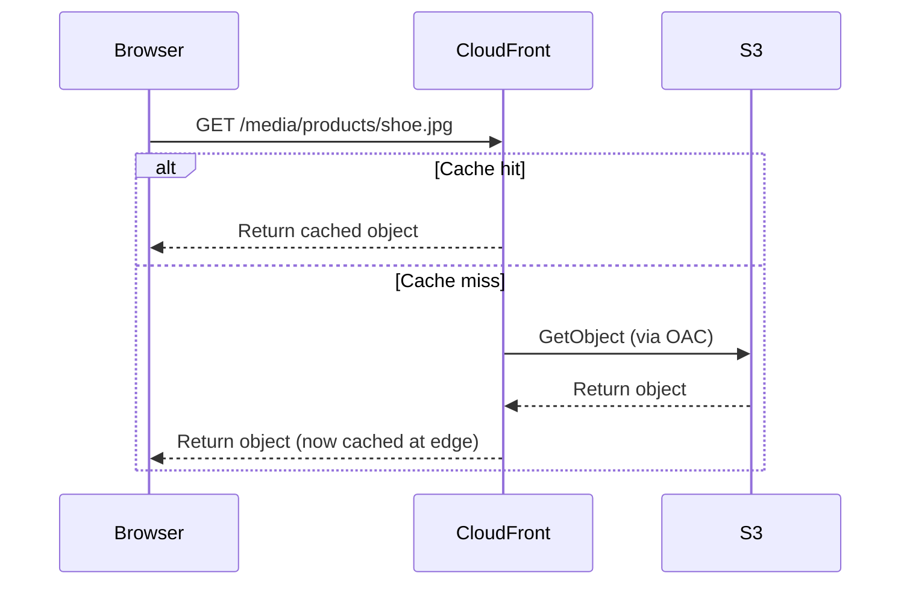

# AWS S3 + Django Integration — Reference Guide

**Reference project:** CommerceCore
**Stack:** Django · EC2 · RDS · S3 · CloudFront
**Scope:** This document is written to be reusable — copy it into any new Django + AWS project and swap the project-specific names (bucket names, IAM user names, domain names).

---

## How to Use This Document

- ✅ = Implemented and verified for CommerceCore
- 🔜 = Next phase for CommerceCore / reference material for when you get there
- Every code block is copy-paste ready. Replace `commercecore` with your project's name when reusing this for a new app.
- Settings assume a split-settings layout (`settings/base.py`, `settings/production.py`, `settings/local.py`) and a `production.py` module loaded on EC2, matching the CommerceCore project structure. Adjust paths if your project uses a single `settings.py`.

---

## Table of Contents

1. [Prerequisites](#1-prerequisites)
2. [Architecture at a Glance](#2-architecture-at-a-glance)
3. [Core Concepts](#3-core-concepts)
4. [Create & Configure the S3 Bucket](#4-create--configure-the-s3-bucket)
5. [IAM & Secure Access](#5-iam--secure-access)
6. [Django Integration](#6-django-integration)
7. [Deployment](#7-deployment)
8. [CloudFront & Private S3](#8-cloudfront--private-s3)
9. [S3 Upload Pipeline Verification](#9-s3-upload-pipeline-verification)
10. [Advanced S3 Concepts](#10-advanced-s3-concepts)
11. [Full Architecture & Request Flows](#11-full-architecture--request-flows)
12. [Troubleshooting & Interview Prep](#12-troubleshooting--interview-prep)
13. [Quick-Start Checklist (New Project Template)](#13-quick-start-checklist-new-project-template)
14. [Environment Variable Reference](#14-environment-variable-reference)
15. [Appendix: Useful AWS CLI Commands](#15-appendix-useful-aws-cli-commands)

---

## Mapping to Your Learning Checklist

| Learning Part | Status | Section Here |
|---|---|---|
| Part 1 – S3 Fundamentals | ✅ Done | §3 |
| Part 2 – Create S3 Bucket | ✅ Done | §4 |
| Part 3 – IAM & Secure Access | ✅ Done | §5 |
| Part 4 – Django Integration | ✅ Done | §6 |
| Part 5 – Deployment Verification | ✅ Done | §7 |
| Part 6 – CloudFront & Private S3 | 🔜 Next | §8 |
| Part 7 – S3 Upload Pipeline | 🔜 Next | §9 |
| Part 8 – Advanced S3 Concepts | 🔜 Reference | §10 |
| Part 9 – Architecture | 🔜 Reference | §11 |
| Part 10 – Interview & Documentation | 🔜 Reference | §12 |

---

## 1. Prerequisites

Before starting S3 integration, you should already have:

- A working Django project deployed on EC2 (Gunicorn + Nginx)
- RDS (PostgreSQL/MySQL) connected as the database backend
- An AWS account with billing alerts configured
- IAM admin access (console or CLI) to create users/policies
- A settings structure that separates `production.py` from `base.py`/`local.py`

---

## 2. Architecture at a Glance



- **EC2** serves the Django app itself (HTML, API responses).
- **S3** stores uploaded media (and optionally static files) — durable, decoupled from compute.
- **CloudFront** sits in front of S3 as a CDN, caching objects at edge locations close to users and hiding the bucket from direct public access.
- **RDS** stores relational data, including the *path/key* to each S3 object (never the file itself).

---

## 3. Core Concepts

**Object storage vs. block/file storage.** S3 stores files as objects (data + metadata + a key) inside buckets, not as a mounted filesystem. There's no folder hierarchy on disk — "folders" you see in the console are just key prefixes (e.g. `media/products/shoe.jpg`).

**Why not store media on the EC2 instance itself?**
- EC2 local disk is ephemeral relative to your app's lifecycle — replacing/scaling the instance can lose files.
- Doesn't scale horizontally — if you add a second EC2 instance behind a load balancer, both need access to the same files.
- S3 offers 99.999999999% (11 nines) durability and virtually unlimited storage.
- Decoupling storage from compute is a standard cloud-native pattern.

**Buckets & Objects.** A bucket is a top-level container (globally unique name across all of AWS). An object is a file plus metadata, addressed by a key (its "path" inside the bucket).

**Static files vs. Media files in Django:**

| | Static Files | Media Files |
|---|---|---|
| Origin | Part of your codebase (CSS, JS, admin assets) | Uploaded by users/admins at runtime |
| Known at | Deploy time | Runtime |
| Managed by | `collectstatic` | Django `FileField`/`ImageField` |
| Mutability | Versioned with code releases | Changes independently of deploys |
| Typical bucket prefix | `static/` | `media/` |

Keeping these on separate prefixes (or even separate buckets) makes lifecycle rules, caching policies, and access control easier to reason about independently.

---

## 4. Create & Configure the S3 Bucket

### 4.1 Naming Convention

Use a predictable, collision-free pattern:

```
<project>-<purpose>-<environment>
commercecore-media-prod
commercecore-static-prod   (optional, if static also moves to S3)
```

Rules: lowercase only, no underscores, 3–63 characters, globally unique across all AWS accounts.

### 4.2 Region

Create the bucket in the **same region as your EC2/RDS** resources to minimize latency and avoid cross-region data transfer charges.

### 4.3 Recommended Settings (Console or CLI)

| Setting | Recommended Value | Why |
|---|---|---|
| Object Ownership | **Bucket owner enforced** (ACLs disabled) | Simplifies permissions; access is controlled entirely by policies, not per-object ACLs |
| Block Public Access | **Keep all 4 boxes checked** | Public access will be granted only through CloudFront (OAC), not the bucket directly |
| Bucket Versioning | **Enabled** | Protects against accidental overwrite/delete; required if you later want lifecycle transitions on noncurrent versions |
| Default Encryption | **SSE-S3** (or SSE-KMS for stricter compliance) | Encrypts objects at rest automatically |

See §15 for the CLI equivalents of each of these settings.

---

## 5. IAM & Secure Access

### 5.1 Principle of Least Privilege

Never use root account keys in an application. Create a dedicated IAM user (or, better, an **EC2 instance role** — see callout below) scoped to exactly one bucket and exactly the actions Django needs.

### 5.2 Least-Privilege Policy

```json
{
  "Version": "2012-10-17",
  "Statement": [
    {
      "Sid": "AllowObjectActions",
      "Effect": "Allow",
      "Action": [
        "s3:PutObject",
        "s3:GetObject",
        "s3:DeleteObject"
      ],
      "Resource": "arn:aws:s3:::commercecore-media-prod/*"
    },
    {
      "Sid": "AllowListBucket",
      "Effect": "Allow",
      "Action": "s3:ListBucket",
      "Resource": "arn:aws:s3:::commercecore-media-prod"
    }
  ]
}
```

### 5.3 Access Keys

- Generate an access key/secret pair for the IAM user (console → Security Credentials).
- Never commit keys to git. Store them only in `.env` (gitignored) or a secrets manager.
- Rotate keys periodically; delete unused keys immediately.

> **Better long-term practice:** attach an **IAM Role** to the EC2 instance itself (via an Instance Profile) with the same least-privilege policy, and drop `AWS_ACCESS_KEY_ID`/`AWS_SECRET_ACCESS_KEY` from your settings entirely — `boto3`/`django-storages` will pick up temporary credentials automatically from the instance metadata service. This avoids long-lived static keys altogether. Worth migrating to once the static-key setup is verified working.

---

## 6. Django Integration

### 6.1 Install Dependencies

```bash
pip install django-storages boto3
```

`requirements.txt`:
```
django-storages[s3]
boto3
```
(Pin exact versions once installed: `pip freeze | grep -E "storages|boto3" >> requirements.txt`.)

### 6.2 `.env.example`

```ini
# --- AWS S3 ---
AWS_ACCESS_KEY_ID=
AWS_SECRET_ACCESS_KEY=
AWS_STORAGE_BUCKET_NAME=commercecore-media-prod
AWS_S3_REGION_NAME=ap-south-1

# --- CloudFront (filled in during Part 6) ---
AWS_CLOUDFRONT_DOMAIN=
```

### 6.3 `.env` (actual values, gitignored — shown redacted)

```ini
AWS_ACCESS_KEY_ID=AKIA************
AWS_SECRET_ACCESS_KEY=************************
AWS_STORAGE_BUCKET_NAME=commercecore-media-prod
AWS_S3_REGION_NAME=ap-south-1
AWS_CLOUDFRONT_DOMAIN=
```

### 6.4 `settings/production.py`

```python
INSTALLED_APPS += ["storages"]

# --- S3 credentials & bucket ---
AWS_ACCESS_KEY_ID = env("AWS_ACCESS_KEY_ID", default=None)
AWS_SECRET_ACCESS_KEY = env("AWS_SECRET_ACCESS_KEY", default=None)
AWS_STORAGE_BUCKET_NAME = env("AWS_STORAGE_BUCKET_NAME")
AWS_S3_REGION_NAME = env("AWS_S3_REGION_NAME", default="ap-south-1")

# --- Behavior ---
AWS_S3_SIGNATURE_VERSION = "s3v4"
AWS_S3_ADDRESSING_STYLE = "virtual"
AWS_S3_FILE_OVERWRITE = False          # don't silently overwrite same-named uploads
AWS_DEFAULT_ACL = None                 # Bucket Owner Enforced -> no per-object ACLs
AWS_QUERYSTRING_AUTH = False           # public read served via CloudFront, no signed query params
AWS_S3_OBJECT_PARAMETERS = {
    "CacheControl": "max-age=86400",
}

# Once CloudFront exists (Part 6), point the custom domain there.
# Until then, this safely falls back to the direct S3 endpoint.
AWS_CLOUDFRONT_DOMAIN = env("AWS_CLOUDFRONT_DOMAIN", default=None)
AWS_S3_CUSTOM_DOMAIN = AWS_CLOUDFRONT_DOMAIN or f"{AWS_STORAGE_BUCKET_NAME}.s3.{AWS_S3_REGION_NAME}.amazonaws.com"

# --- Django 4.2+ storage backend config ---
STORAGES = {
    "default": {
        "BACKEND": "storages.backends.s3.S3Storage",
        "OPTIONS": {"location": "media"},
    },
    "staticfiles": {
        "BACKEND": "django.contrib.staticfiles.storage.StaticFilesStorage",
    },
}

MEDIA_URL = f"https://{AWS_S3_CUSTOM_DOMAIN}/media/"
```

> **Django version note:** `STORAGES` is the modern setting (Django ≥ 4.2). On older Django, use `DEFAULT_FILE_STORAGE = "storages.backends.s3boto3.S3Boto3Storage"` instead — the class name also differs (`s3boto3.S3Boto3Storage` vs the newer `s3.S3Storage`). Check your installed `django-storages` version's docs if `storages.backends.s3` import errors.

> **Static files:** kept on local `StaticFilesStorage` + Nginx/WhiteNoise above, since that's the common pattern (static assets rarely change and are cheap to serve directly). If you want static files on S3/CloudFront too, add a second bucket/prefix and a matching `"staticfiles"` entry using the S3 backend with `"location": "static"`.

---

## 7. Deployment

### 7.1 Update Production Environment

SSH into EC2 and update `.env` with the real bucket name, region, and IAM credentials (§6.3).

### 7.2 `deploy.sh`

```bash
#!/usr/bin/env bash
set -e

cd /home/ubuntu/CommerceCore
git pull origin main

source venv/bin/activate
pip install -r requirements.txt

python manage.py migrate --noinput
python manage.py collectstatic --noinput

sudo systemctl restart gunicorn
sudo systemctl restart nginx

echo "Deployment complete."
```

### 7.3 Verification Steps

```bash
# Check Gunicorn started cleanly
sudo systemctl status gunicorn

# Tail logs for storage/boto errors
sudo journalctl -u gunicorn -f

# Confirm Django can reach S3 from a shell
python manage.py shell -c "
from django.core.files.storage import default_storage
print(default_storage.exists('media/'))
"
```

Then upload a test image via Django admin and confirm:
1. It appears in the S3 console under `media/`.
2. The `ImageField` in the DB stores the S3 key, not a local path.
3. The rendered `` URL resolves and loads the image in a browser.

---

## 8. CloudFront & Private S3

*(Next phase for CommerceCore — Part 6 of your checklist.)*

### 8.1 Why Private Buckets + CDN

Serving media directly from a public S3 bucket works, but has downsides: no caching (every request hits S3 and incurs cost), no single point to attach WAF/rate-limiting, and a publicly-writable-looking URL structure. Fronting a **private** bucket with CloudFront gives you edge caching, a stable custom domain, and one place to control access.

### 8.2 What CloudFront Does

CloudFront is AWS's CDN: it caches your objects at edge locations worldwide so repeat requests are served from a nearby cache instead of hitting the origin (S3) every time — lower latency, lower origin load, lower cost.

### 8.3 Origin Access Control (OAC)

OAC is the current, recommended mechanism for letting CloudFront — and only CloudFront — read from a private S3 bucket (it replaced the older Origin Access Identity / OAI). Steps:

1. In the CloudFront console, create a distribution with your S3 bucket as the origin.
2. Choose **Origin Access Control** and create a new OAC setting (SigV4, "sign requests").
3. CloudFront will prompt you to update the **bucket policy** — accept the suggested policy or apply manually:

```json
{
  "Version": "2012-10-17",
  "Statement": [
    {
      "Sid": "AllowCloudFrontServicePrincipal",
      "Effect": "Allow",
      "Principal": { "Service": "cloudfront.amazonaws.com" },
      "Action": "s3:GetObject",
      "Resource": "arn:aws:s3:::commercecore-media-prod/*",
      "Condition": {
        "StringEquals": {
          "AWS:SourceArn": "arn:aws:cloudfront::<account-id>:distribution/<distribution-id>"
        }
      }
    }
  ]
}
```

This grants read access *only* to requests coming through that specific CloudFront distribution — Block Public Access can stay fully enabled on the bucket.

### 8.4 Update Django

Set `AWS_CLOUDFRONT_DOMAIN` in `.env` to the distribution's domain (e.g. `d1234abcd.cloudfront.net`, or a custom domain if you attach one via Route 53 + ACM). The `production.py` settings in §6.4 already prefer this over the raw S3 endpoint once it's set — no code change needed, just redeploy.

### 8.5 Test Delivery

```bash
curl -I https://<your-cloudfront-domain>/media/products/shoe.jpg
```

Look for `X-Cache: Hit from cloudfront` on the second request (first request is typically a miss).

### 8.6 Cache Invalidation

If you re-upload a file at the same key and the old version keeps serving, invalidate the cached path:

```bash
aws cloudfront create-invalidation --distribution-id <DIST_ID> --paths "/media/products/shoe.jpg"
```

(Prefer changing the filename/key on re-upload where possible — invalidations are rate-limited and cost extra beyond a free monthly allowance.)

---

## 9. S3 Upload Pipeline Verification

*(Part 7 of your checklist — do this once CloudFront is live.)*

- [ ] Upload a product image through the app (not the AWS console)
- [ ] Confirm the object appears under the correct prefix in the S3 console
- [ ] Confirm the rendered image URL uses the CloudFront domain, not the raw S3 endpoint
- [ ] Confirm the DB field stores the **key** (e.g. `media/products/shoe.jpg`), not an absolute local path
- [ ] Confirm `MEDIA_ROOT` / local `media/` folder is empty or unused in production — everything should be flowing to S3
- [ ] Delete the test object and confirm the DB reference is handled gracefully (broken image vs. crash) — decide if you need a cleanup signal on model delete

---

## 10. Advanced S3 Concepts

*(Part 8 of your checklist.)*

### 10.1 Public vs. Private Buckets

| | Public Bucket | Private Bucket + CloudFront OAC |
|---|---|---|
| Direct S3 URL access | Works | Blocked (403) |
| Caching | None (every hit is an S3 request) | Edge-cached |
| Attack surface | Bucket itself is a target | Only CloudFront is public-facing |
| Recommended for | Quick prototypes | Production |

### 10.2 Presigned URLs

Use when you need to grant **temporary** access to a private object (e.g. a user's invoice PDF) without making it public:

```python
import boto3

s3_client = boto3.client("s3", region_name="ap-south-1")

url = s3_client.generate_presigned_url(
    "get_object",
    Params={"Bucket": "commercecore-media-prod", "Key": "media/invoices/invoice_123.pdf"},
    ExpiresIn=300,  # seconds
)
```

The same method works for presigned **uploads** (`put_object`), letting a browser upload directly to S3 without proxying the file through Django.

### 10.3 Versioning (Practical)

With versioning enabled (§4.3), overwriting or deleting an object creates a new version rather than destroying data:

```bash
aws s3api list-object-versions --bucket commercecore-media-prod --prefix media/products/shoe.jpg
aws s3api get-object --bucket commercecore-media-prod --key media/products/shoe.jpg --version-id <VERSION_ID> shoe_restored.jpg
```

### 10.4 Lifecycle Rules

Automate cost management over time — e.g. move noncurrent versions to cheaper storage, or expire them:

```json
{
  "Rules": [
    {
      "ID": "ExpireOldVersions",
      "Status": "Enabled",
      "NoncurrentVersionExpiration": { "NoncurrentDays": 90 }
    }
  ]
}
```

### 10.5 Storage Classes

| Class | Use Case | Retrieval Time | Relative Cost |
|---|---|---|---|
| S3 Standard | Frequently accessed media (default) | Immediate | Highest of the "hot" tiers |
| S3 Standard-IA | Infrequent access, needs fast retrieval | Immediate | Lower storage cost + retrieval fee |
| S3 One Zone-IA | Infrequent, reproducible/non-critical data | Immediate | Lower than Standard-IA |
| S3 Glacier Instant Retrieval | Archive, rarely accessed | Milliseconds | Low |
| S3 Glacier Flexible Retrieval | Long-term archive | Minutes–hours | Very low |
| S3 Glacier Deep Archive | Compliance/long-term backup | Hours | Lowest |

### 10.6 Cost Optimization Tips

- Enable **S3 Intelligent-Tiering** if access patterns are unpredictable — it auto-moves objects between tiers.
- Set `CacheControl` headers (already in §6.4) so CloudFront/browsers cache aggressively and reduce origin hits.
- Use lifecycle rules to expire old object *versions*, not just current objects, or versioning storage cost creeps up silently.
- Watch CloudFront data transfer — it's usually cheaper than S3 direct transfer for repeat-read content.

### 10.7 Security Best Practices Checklist

- [ ] Block Public Access enabled on every bucket that doesn't explicitly need public reads
- [ ] Default encryption (SSE-S3 or SSE-KMS) enabled
- [ ] IAM policy scoped to a single bucket ARN, minimum required actions
- [ ] No root account keys used anywhere in application code
- [ ] Prefer EC2 instance role over static IAM keys where possible
- [ ] CloudTrail logging enabled for S3 data events if auditing access is required
- [ ] MFA Delete considered for buckets holding critical/irreplaceable data
- [ ] Access keys rotated on a schedule; unused keys deleted

---

## 11. Full Architecture & Request Flows

*(Part 9 of your checklist.)*

### 11.1 Upload Flow (Django → S3)



### 11.2 Read Flow (Browser → CloudFront → S3)



### 11.3 High-Level Production Architecture

See the diagram in §2 — EC2 (Django) talks to RDS for data and to S3 for object storage; the browser talks to EC2 for pages/API and to CloudFront for all static/media assets.

---

## 12. Troubleshooting & Interview Prep

*(Part 10 of your checklist.)*

### 12.1 Common Troubleshooting

| Symptom | Likely Cause | Fix |
|---|---|---|
| `403 Forbidden` on image URL | Bucket policy doesn't allow the CloudFront OAC, or wrong distribution ARN in policy condition | Re-check bucket policy `Principal`/`Condition` against §8.3 |
| `SignatureDoesNotMatch` | Wrong secret key, or EC2 clock drift | Regenerate keys; verify server time sync (`chronyd`/`ntp`) |
| Old image still shows after re-upload | CloudFront edge cache serving stale object | Create an invalidation (§8.6), or change the object key on upload |
| `NoSuchBucket` | Bucket name/region mismatch in settings | Confirm `AWS_STORAGE_BUCKET_NAME` and `AWS_S3_REGION_NAME` match the created bucket exactly |
| DB stores local path instead of S3 key | Wrong settings module loaded, or `STORAGES["default"]` still pointing at local storage | Confirm EC2 is running with `DJANGO_SETTINGS_MODULE=settings.production` |
| `AccessDenied` when Django uploads | IAM policy missing `PutObject` on the resource path | Ensure policy `Resource` includes the `/*` suffix (§5.2) |
| Gunicorn won't pick up new env vars after deploy | Process manager reloaded code but didn't restart the process | `systemctl restart gunicorn` (reload isn't enough for env var changes) |

### 12.2 Interview Questions & Answers

**Why use S3 instead of storing media on the EC2 instance?**
Durability (11 nines), decouples storage from compute so instances can be replaced/scaled without losing files, and it integrates natively with a CDN.

**What's the difference between OAI and OAC?**
OAC (Origin Access Control) is the current recommended mechanism for CloudFront-to-S3 access, succeeding the older OAI. It supports SigV4 signing, works with SSE-KMS-encrypted objects, and offers finer-grained, per-distribution policies.

**What is a presigned URL and when would you use one?**
A time-limited URL that grants temporary access to a private S3 object without making the bucket public — used for private downloads (invoices, user documents) or direct browser-to-S3 uploads.

**Why keep the bucket private with CloudFront in front, instead of a public bucket?**
Reduces the attack surface to one service (CloudFront), enables caching to cut cost/latency, and lets you swap or reconfigure the origin without changing the public-facing URL.

**What does "Block Public Access" actually do?**
An account/bucket-level safety net that prevents ACLs or bucket policies from accidentally exposing objects publicly — kept on even when using CloudFront, since access is granted narrowly to the CloudFront service principal only.

**Static files vs. media files — why treat them differently?**
Static files are known at deploy time, versioned with code, and produced by `collectstatic`. Media files are user-generated at runtime and need independent lifecycle/versioning/backup policies.

**How does Django know to use S3 instead of local disk?**
Through the `STORAGES["default"]["BACKEND"]` setting (or legacy `DEFAULT_FILE_STORAGE`) pointing to `storages.backends.s3.S3Storage` — every `FileField`/`ImageField` save then routes through `django-storages`/`boto3` automatically.

**What's the benefit of an EC2 instance role over static IAM access keys?**
Temporary, auto-rotated credentials with no secret to leak or manually rotate — `boto3` fetches them transparently from instance metadata.

---

## 13. Quick-Start Checklist (New Project Template)

Copy this into any new project's docs when starting fresh:

```markdown
### AWS S3 + Django Setup — Quick Checklist

- [ ] Create S3 bucket: <project>-media-<env>, correct region
- [ ] Object Ownership: Bucket owner enforced
- [ ] Block Public Access: all 4 enabled
- [ ] Versioning: enabled
- [ ] Default encryption: SSE-S3
- [ ] Create IAM user/role with least-privilege policy (scoped to bucket ARN)
- [ ] pip install django-storages boto3
- [ ] Add AWS_* vars to .env.example and .env
- [ ] Configure STORAGES in production settings
- [ ] Deploy, restart Gunicorn, verify upload end-to-end
- [ ] Create CloudFront distribution with OAC origin
- [ ] Update bucket policy for CloudFront service principal
- [ ] Point AWS_CLOUDFRONT_DOMAIN / MEDIA_URL to CloudFront
- [ ] Test delivery (curl -I, check X-Cache header)
- [ ] Set CacheControl headers + lifecycle rules
- [ ] Confirm local media/ folder unused in production
```

---

## 14. Environment Variable Reference

| Variable | Description | Example |
|---|---|---|
| `AWS_ACCESS_KEY_ID` | IAM user access key (omit if using an EC2 instance role) | `AKIA...` |
| `AWS_SECRET_ACCESS_KEY` | IAM user secret key | *(secret, never commit)* |
| `AWS_STORAGE_BUCKET_NAME` | S3 bucket name for media | `commercecore-media-prod` |
| `AWS_S3_REGION_NAME` | AWS region of the bucket | `ap-south-1` |
| `AWS_CLOUDFRONT_DOMAIN` | CloudFront distribution domain used as the custom domain for media URLs | `d1234abcd.cloudfront.net` |

---

## 15. Appendix: Useful AWS CLI Commands

```bash
# Create bucket
aws s3 mb s3://commercecore-media-prod --region ap-south-1

# Enable versioning
aws s3api put-bucket-versioning \
  --bucket commercecore-media-prod \
  --versioning-configuration Status=Enabled

# Enable default encryption (SSE-S3)
aws s3api put-bucket-encryption \
  --bucket commercecore-media-prod \
  --server-side-encryption-configuration '{"Rules":[{"ApplyServerSideEncryptionByDefault":{"SSEAlgorithm":"AES256"}}]}'

# Block all public access
aws s3api put-public-access-block \
  --bucket commercecore-media-prod \
  --public-access-block-configuration BlockPublicAcls=true,IgnorePublicAcls=true,BlockPublicPolicy=true,RestrictPublicBuckets=true

# List objects under a prefix
aws s3 ls s3://commercecore-media-prod/media/ --recursive

# Invalidate a CloudFront cache path after re-upload
aws cloudfront create-invalidation \
  --distribution-id <DIST_ID> \
  --paths "/media/products/*"
```

---

*End of guide. When starting the next project, duplicate this file, rename the project-specific values, and work top to bottom — Parts 1–7 are your build order, Parts 8–12 are what you'll need once things are live.*